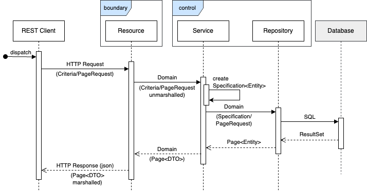
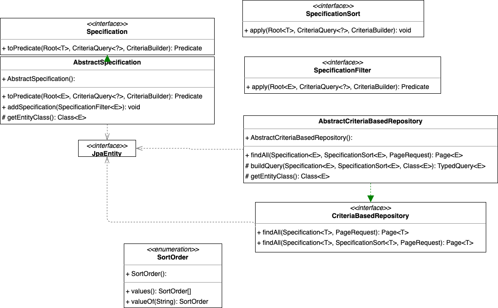

# jakarta-data-presentation

## Intro

This repo scratches the surface of the features of jakarta-data 1.0 and Jakarta EE Persistence 3.0.

Illustrative features are exposed as JUnit tests.

### To run the tests

* Run the tests with `./mvnw clean package`.
* Review the code in the respective entity and control packages.

## Basis

### Specification Resources


* [Github jakarta-data](https://github.com/jakartaee/data)

* [JavaDocs jakarta-data](https://jakarta.ee/specifications/data/1.0/apidocs/jakarta.data/module-summary)

* [Jakarta EE Persistence Website](https://jakartaee.github.io/persistence/)

### Articles

This repo provides data and code for the articles by Gavin King:

https://gavinking.substack.com/p/a-preview-of-jakarta-data-10

https://gavinking.substack.com/p/a-summary-of-jakarta-persistence

and of Thorben Jannsen:

https://thorben-janssen.com/getting-started-with-jakarta-data/

and of Otavio Santana

https://dzone.com/articles/data-management-with-offset-and-cursor-based-pagination

Gavin is the author of Hibernate and Thorben is a Hibernate author. Otavio is an active participant in Java standardisation related gremiums.

The articles are well-written and provide an excellent overview of the basic features.

## Required Dependencies in Quarkus

```xml
    <dependencies>
    <dependency>
        <groupId>io.quarkus</groupId>
        <artifactId>quarkus-hibernate-orm</artifactId>
    </dependency>
    <dependency>
        <groupId>jakarta.data</groupId>
        <artifactId>jakarta.data-api</artifactId>
        <version>1.0.1</version>
    </dependency>
    <!-- Include here because otherwise incremental compilation
           in IntelliJ would otherwise be broken. Normally declaring this in
           the annotation-processor section should have been enough -->
    <dependency>
        <groupId>org.hibernate.orm</groupId>
        <artifactId>hibernate-jpamodelgen</artifactId>
        <version>6.6.2.Final</version>
    </dependency>
        <!-- ... -->
    </dependencies>
```


## Key Points

### Standards compliant and competitive


There is a major update of the persistence API. jakarta-data is brand new and is very competitive. Both are now part of the standard. It looks like things like Spring Data has been leap-frogged. Central arguments for alternate approaches such as JOOQ have become moot.

### Technology Highlights

* Typesafe Critieria API and annotations. Errors caught at compile-time.
* Entity-independent repos
* Data-derived behaviour (method naming no longer determines behaviour)
* Standard Lifecycle Methods
* Pagination Support

### Important Considerations

From the Janssen article: "Jakarta Data repositories are stateless, and Jakarta Data doesn’t support implicit lazy fetching. If you want to use a lazily fetched association in your business code, you must fetch it when reading the entity object. Using a JOIN FETCH clause in your query is the easiest way to do that."

```java
@Repository
public interface ChessPlayerRepository {

    @Query("FROM ChessPlayer p JOIN FETCH tournaments t WHERE p.lastName = :lastName")
    ChessPlayer findByLastNameWithTournament(String lastName);

}
```

Again from Janssen: "Modified entities are not automatically updated in your data store. So, you have to trigger the update programmatically whenever you want to persist your changes."

```java
ChessPlayer player = new ChessPlayer();
player.setFirstName("Tohrben");
player.setLastName("Janssen");
playerRepo.persist(player);

player.setFirstName("Thorben");
playerRepo.update(player);
```

### Gotchas

#### Lombok 

Lombok must be processed before jakarta-data-gen.
See the maven-compiler-plugin in the pom.xml.

#### jpamodelgen Dependency Declaration
It would be normally sufficient to declare the jpamodelgen dependency in the  <annotationProcessorPath> for , i.e., do not declare this dependency in the dependencies section.
This is because it is not normal to have an annotation processor in a runtime classpath, and making the dependency provided would cause problems.
One problem is that it interferes with IntelliJ incremental compilation.
https://github.com/quarkusio/quarkus/wiki/Migration-Guide-3.7#jpamodelgen

The above reference lists further considerations, for instance if you are using IDEs other than IntelliJ, or web-based IDEs.

### Implications

We need to review our ISCeco exception-handling library to ensure that all the generated exceptions are handled.

## Pagination

jakarta-data offers two interfaces:

* Use **jakarta.data.Page** if you have simpler use cases with manageable data sizes, and you prefer traditional page-numbered navigation.
* Use **jakarta.data.CursoredPage** for handling large, dynamic datasets that require efficient pagination without performance bottlenecks.

### Page

Easier to implement and use for straightforward use cases.
Suitable when the total dataset size is small to moderate, or when accessing data randomly across pages.

### CursoredPage

Cursor-based pagination often leverages database identifiers to mark the current position, making it more efficient for large datasets with better performance.

This form of pf pagination works well when dataset sizes are dynamic and change frequently, ensuring that each page load causes less strain on the database. It also helps in avoiding issues where data modifications between paginations may cause items to move between pages, reducing the chances of duplicate data loading.

## Criteria-based Repositories

If you have a use case in which you have dynamic filters, i.e. filters unknown in advance, then the solution available to you in the Java standards space is the Criteria API.


jakarta-data offers two interfaces for 

### Do I need a Criteria-based repository?

A criteria-based repository obviously is the only choice when your filtering and ordering parameters cannot be known in advance.

If you, however, do know the filtering parameters up-front without user input, then the solutions available to you with jakarta-data, jakarta-persistence and hibernate are much simpler.

### Process

The following gives an overview of the process of calling a service that in turn calls a criteria-based repository:



### Class Diagram "Blueprint" Classes

These are the classes that are candidates for the Blueprint:




### Future Direction

The specification functions can be enhanced for _group by_, _having_ and perhaps other more complex scenarios.

